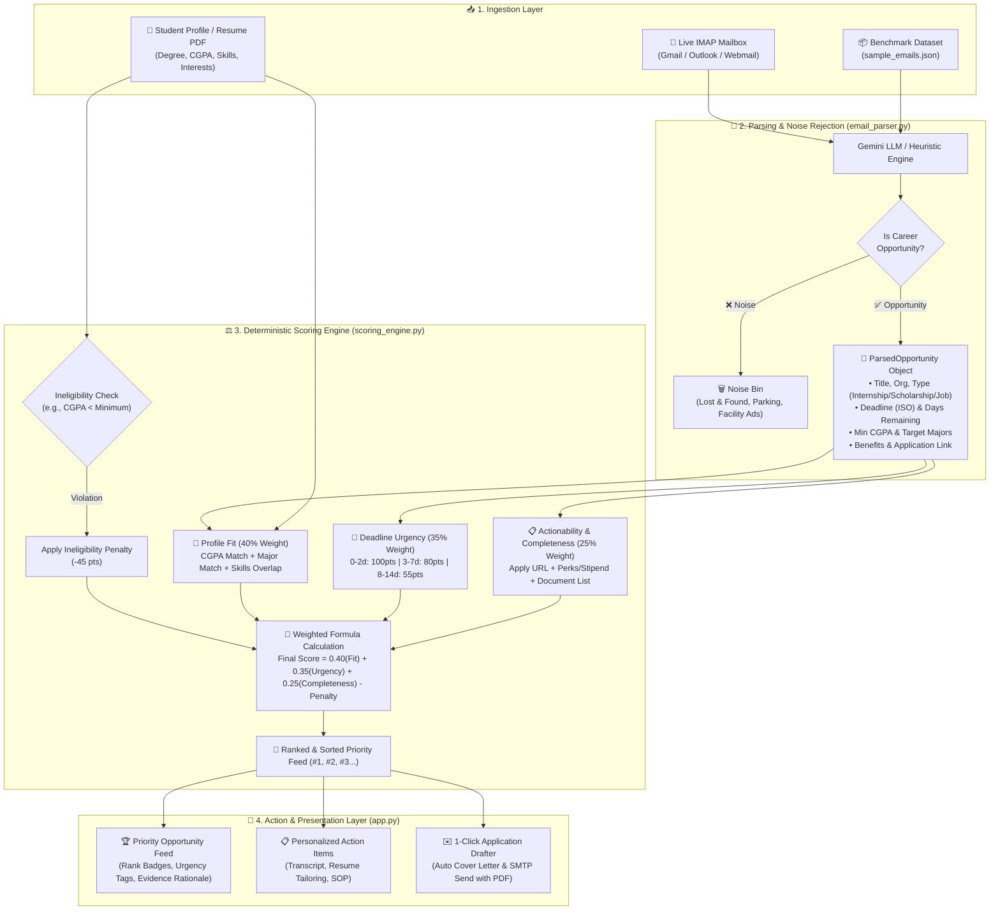

# 🎓 Opportunity Inbox Copilot
### *Intelligent University Email Parsing, Noise Filtering & Deterministic Opportunity Ranking*

[](https://www.python.org/)
[](https://streamlit.io/)
[](LICENSE)

An intelligent, full-stack student copilot designed to solve **information overload** in university and personal inboxes. It connects to live email servers (or accepts benchmark datasets), separates signal from noise, extracts critical metadata, and ranks career opportunities using a **transparent, deterministic mathematical scoring formula** customized to the student's unique academic profile and resume.

---

## 🏢 Business Problem & Motivation

University students, researchers, and early-career professionals receive **hundreds of emails weekly** across academic mailing lists, career portals, and department newsletters. This leads to three critical breakdowns:

1. **Information Overload & High Noise Ratio**: High-value career opportunities (internships, scholarships, research grants, hackathons) are buried under campus noise (lost & found, parking advisories, commercial course promotions, event reminders).
2. **Missed Deadlines & Lost Opportunities**: Time-sensitive announcements (e.g., closing in 48 hours) are easily overlooked in standard chronological inboxes.
3. **Mismatched Eligibility & Wasted Effort**: Students spend valuable hours manually reviewing long email threads only to find out they don't meet specific eligibility criteria (e.g., CGPA cutoffs, specific majors, graduation year, or missing prerequisites).

### 🎯 What We Are Solving (Core Value Proposition)

Opportunity Inbox Copilot solves the **"Opportunity Discovery & Triage Friction"** by converting an unstructured, noisy email inbox into an **action-oriented, personalized, high-priority feed**.

| Before (The Problem) | After (Opportunity Inbox Copilot) |
| :--- | :--- |
| **Unstructured Text**: Scrolling through long, repetitive email bodies. | **Structured Intelligence**: Automated extraction of deadlines, stipends, eligibility criteria, and direct application links. |
| **Spam & Clutter**: Important scholarships lost in campus announcements. | **Automated Noise Filtering**: Non-opportunity emails are quarantined into a dedicated Noise Bin. |
| **Chronological Inbox**: Emails sorted by arrival time, not relevance or deadline. | **Deterministic Personalized Ranking**: Scored mathematically based on student profile fit (40%), deadline urgency (35%), and actionable completeness (25%). |
| **Application Friction**: Manual resume tailoring and drafting. | **Action Checklist & 1-Click Drafting**: Personalized to-dos and tailored AI-drafted cover letters sent directly via SMTP. |

> 💡 **Elevator Pitch:** *"Students miss out on life-changing scholarships and internships because their university inboxes are flooded with campus noise and poorly formatted emails. **Opportunity Inbox Copilot** acts as an intelligent career filter: it reads emails in real-time, extracts key eligibility and deadline criteria, matches them against the student's resume, and produces a mathematically ranked priority feed with 1-click application tools."*

---

## 🌟 Key Capabilities & Highlights

* 🤖 **Dual-Engine Entity Extraction**: Powered by Google Gemini with a zero-dependency offline heuristic fallback. Extracts opportunity types, deadlines, eligibility criteria, stipends, required documents, and apply links.
* 🗑️ **Intelligent Noise & Spam Rejection**: Automatically filters campus facility announcements, lost & found, commercial course ads, and transactional notifications into a dedicated Noise Bin.
* ⚖️ **100% Deterministic Multi-Factor Scoring**: Transparent, auditable mathematical ranking combining **Profile Fit (40%)**, **Deadline Urgency (35%)**, and **Completeness (25%)**, with automatic ineligibility penalties.
* 📧 **Live IMAP Email Connector & Real-Time Auto-Watcher**:
  * **⚡ Fetch Only Live Emails**: Scans unread incoming emails (`UNSEEN`) in real-time.
  * **📥 Fetch Latest Emails**: Scans recent inbox history (`ALL`).
  * **🔄 Fetch Both Latest & Live**: Merges live mailbox streams with benchmark opportunities.
  * **⚡ Background Daemon**: Polls mailboxes in real-time and triggers instant ranking notifications.
* 📄 **Resume PDF Intelligence**: Upload your `resume.pdf` to auto-extract CGPA, degree, and skills, or switch between pre-configured student personas (CS, BBA, SE, etc.).
* 📋 **Action Checklist Generator**: Translates opportunity requirements into personalized to-dos (e.g., *"Request Transcript (Current CGPA: 3.85)"*, *"Tailor Resume for Python/PyTorch"*).
* ✉️ **1-Click AI Application Drafter**: Generates tailored cover letters and sends applications directly via SMTP with the student's uploaded resume attached.

---

## 🏛️ System Architecture & End-to-End Flow



---

## 🧮 Deterministic Scoring Formula & Criteria

Rankings are **100% reproducible, explainable, and deterministic** without arbitrary black-box hallucinations.

$$\text{Final Score} = \left( 0.40 \times S_{\text{fit}} \right) + \left( 0.35 \times S_{\text{urgency}} \right) + \left( 0.25 \times S_{\text{completeness}} \right) - \text{Penalty}_{\text{ineligible}}$$

```
                      ┌─────────────────────────────────────────┐
                      │            FINAL SCORE (0-100)          │
                      └────────────────────┬────────────────────┘
                                           │
         ┌─────────────────────────────────┼─────────────────────────────────┐
         │ (40% Weight)                    │ (35% Weight)                    │ (25% Weight)
         ▼                                 ▼                                 ▼
┌──────────────────┐              ┌──────────────────┐              ┌──────────────────┐
│   PROFILE FIT    │              │ DEADLINE URGENCY │              │   COMPLETENESS   │
├──────────────────┤              ├──────────────────┤              ├──────────────────┤
│• CGPA Match: +25 │              │• 0-2 Days: 100pts│              │• Apply URL:  +40 │
│• Major Match:+25 │              │• 3-7 Days:  80pts│              │• Stipend/Perk:+30│
│• Skills:     +25 │              │• 8-14 Days: 55pts│              │• Doc List:   +30 │
│• Type Pref:  +25 │              │• 15+ Days:  30pts│              └──────────────────┘
│• Need Bonus: +10 │              │• Expired: -1000pt│
└──────────────────┘              └──────────────────┘
         │
         ▼
┌────────────────────────────────────────────────────────┐
│  INELIGIBILITY PENALTY: -45 pts if CGPA < Min Criteria │
└────────────────────────────────────────────────────────┘
```

### Breakdown of Scoring Factors:

1. **Profile Fit Score ($S_{\text{fit}}$, 40% Weight)**:
   * **CGPA Match (+25 pts)**: Awarded when student CGPA satisfies the opportunity threshold.
   * **Major / Degree Match (+25 pts)**: Awarded when the student's department aligns with target fields.
   * **Skills & Keywords (+25 pts)**: Direct overlap between student skills and job requirements.
   * **Opportunity Preference (+25 pts)**: Aligns with target type (Internship, Scholarship, Hackathon, Research).
   * **Financial Need Bonus (+10 pts)**: Prioritizes need-based grants for eligible students.

2. **Deadline Urgency Score ($S_{\text{urgency}}$, 35% Weight)**:
   * **0 to 2 Days Remaining**: $100\text{ pts}$ (🚨 Critical Urgency)
   * **3 to 7 Days Remaining**: $80\text{ pts}$ (⚡ High Urgency)
   * **8 to 14 Days Remaining**: $55\text{ pts}$ (⏳ Medium Urgency)
   * **15+ Days Remaining**: $30\text{ pts}$ (📅 Low Urgency)
   * **Past Deadline**: $-1000\text{ pts}$ (❌ Expired Archive)

3. **Actionability & Completeness Score ($S_{\text{completeness}}$, 25% Weight)**:
   * **Direct Application Portal URL (+40 pts)**: Verified link for immediate student submission.
   * **Explicit Stipend / Financial Perks (+30 pts)**: Clearly stated financial compensation or benefits.
   * **Enumerated Document Requirements (+30 pts)**: Detailed list of required submissions.

4. **Ineligibility Penalty**:
   * If a student does not meet strict requirements (e.g. CGPA is $2.50$ when minimum required is $3.75$), an automatic **$-45\text{ pts}$ penalty** is deducted and a warning tag is generated.

---

## 🛠️ Project Structure

```bash
Personalized Opportunity Ranking/
├── architecture.md           # Formal architectural specification & Mermaid flowcharts
├── README.md                 # Project documentation
└── codebase/
    ├── app.py                # Main Streamlit Dashboard Application
    ├── config.py             # System constants, scoring weights, and API configuration
    ├── requirements.txt      # Python dependencies
    ├── test_pipeline.py      # End-to-end verification test suite (13 test cases)
    ├── assets/
    │   └── styles.css        # Premium dark glassmorphic CSS theme
    ├── data/
    │   ├── sample_emails.json   # 10 realistic university/career benchmark emails
    │   └── preset_profiles.json # 4 diverse student personas (CS, BBA, SE, Pre-Med)
    ├── models/
    │   ├── opportunity.py    # Pydantic data schemas for Opportunities & Actions
    │   └── profile.py        # Pydantic data schemas for Student Profiles
    └── services/
        ├── email_parser.py        # AI LLM entity extractor & spam classifier
        ├── scoring_engine.py      # Deterministic mathematical ranking engine
        ├── checklist_service.py   # Personalized action checklist generator
        ├── resume_parser.py       # Resume PDF intelligence extractor
        ├── imap_sync_service.py   # Secure IMAP SSL live email connector
        ├── mailbox_watcher.py     # Background auto-polling watcher daemon
        └── application_service.py # 1-click SMTP application drafter & sender
```

---

## 🚀 Getting Started

### 1. Prerequisites
* Python 3.10 or higher
* Recommended: Virtual environment (`venv`)

### 2. Installation

```bash
# Clone the repository
git clone https://github.com/<your-username>/Personalized-Opportunity-Inbox.git
cd Personalized-Opportunity-Inbox/codebase

# Create and activate virtual environment
python3 -m venv venv
source venv/bin/activate   # On Windows: venv\Scripts\activate

# Install dependencies
pip install -r requirements.txt
```

### 3. Environment Configuration (Optional)
Copy `.env.example` to `.env` to configure your API keys or leave blank to use the intelligent offline heuristic parser:

```bash
cp .env.example .env
```

```ini
# Optional: Google Gemini API key for LLM-powered parsing
GEMINI_API_KEY=your_gemini_api_key_here

# System Scoring Weights (Must sum to 1.0)
WEIGHT_PROFILE_FIT=0.40
WEIGHT_URGENCY=0.35
WEIGHT_COMPLETENESS=0.25
```

### 4. Running the Application

Launch the Streamlit interactive dashboard:

```bash
streamlit run app.py
```

Open your browser at **`http://localhost:8501`**.

---

## 🧪 Verification & Test Suite

Run the comprehensive end-to-end verification suite:

```bash
python3 test_pipeline.py
```

This verifies all 13 critical subsystems:
* ✅ Mathematical weights consistency ($0.40 + 0.35 + 0.25 = 1.0$)
* ✅ Dataset loading and schema validation
* ✅ AI entity extraction & spam/noise rejection
* ✅ Multi-persona dynamic ranking (CS Senior vs BBA Junior)
* ✅ Ineligibility penalty enforcement
* ✅ Action checklist generation
* ✅ Resume PDF intelligence parsing
* ✅ IMAP HTML cleaning and MIME header decoding
* ✅ SMTP application drafting and background daemon thread safety
