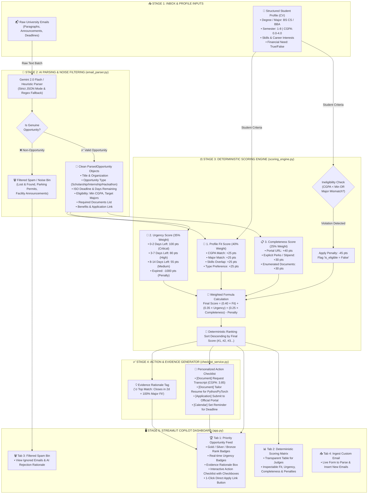

# 🏛️ Opportunity Inbox Copilot — System Architecture & Data Flow

**SOFTEC 2026 AI Hackathon Competition**  
*Email Parsing, Noise Rejection & Personalized Opportunity Ranking System*

---

## 🎯 1. End-to-End System Pipeline & Data Flow Diagram

---

## 🔍 2. Step-by-Step Data Flow Narrative

| Stage | Process Description | Input Data | Output Data |
| :---: | :--- | :--- | :--- |
| **Stage 1** | **Input Ingestion** | Raw messy emails (`sample_emails.json`) + Student form inputs (`StudentProfile`). | Plain text strings & profile object. |
| **Stage 2** | **AI Parsing & Noise Filter** | Email parser runs Gemini LLM (JSON Mode) or heuristic fallback to separate spam from real opportunities. | `ParsedOpportunity` objects + filtered spam list. |
| **Stage 3** | **Deterministic Scoring** | Pure Python engine calculates Fit ($40\%$), Urgency ($35\%$), and Completeness ($25\%$), then applies ineligibility penalties. | Auditable `ScoringBreakdown` and final ranks (`#1..#N`). |
| **Stage 4** | **Checklist Generation** | Maps parsed documents and URLs to tailored student action items and calendar reminders. | `List[ActionItem]` and evidence tags. |
| **Stage 5** | **Copilot Presentation** | Streamlit UI renders ranked cards, live persona switching, scoring matrices, and interactive checklists. | Interactive Web Dashboard on `localhost:8501`. |

---

## 📐 3. Mathematical Formula Specification

$$\text{Final Score} = (\underbrace{0.40 \times S_{\text{fit}}}_{\text{40% Profile Fit}}) + (\underbrace{0.35 \times S_{\text{urgency}}}_{\text{35% Deadline Urgency}}) + (\underbrace{0.25 \times S_{\text{completeness}}}_{\text{25% Actionability \& Perks}}) - \text{Penalty}_{\text{ineligible}}$$

### 🔹 Sub-Score Calculation Rules:
* **$S_{\text{fit}}$ (0 to 100 pts)**:
  * $\text{CGPA Match}$: $+25\text{ pts}$ if $\text{Student CGPA} \ge \text{Min CGPA}$
  * $\text{Major Match}$: $+25\text{ pts}$ if degree matches target fields
  * $\text{Skills Overlap}$: $+25\text{ pts}$ for keyword overlap
  * $\text{Preferred Type}$: $+25\text{ pts}$ for prioritized category
  * $\text{Financial Need}$: $+10\text{ pts}$ bonus if need-based
* **$S_{\text{urgency}}$ (0 to 100 pts)**:
  * $0 \le \text{days} \le 2$: $100\text{ pts}$ (🚨 Critical Urgency)
  * $3 \le \text{days} \le 7$: $80\text{ pts}$ (⚡ High Urgency)
  * $8 \le \text{days} \le 14$: $55\text{ pts}$ (⏳ Medium Urgency)
  * $\text{days} \ge 15$: $30\text{ pts}$ (📅 Low Urgency)
  * $\text{days} < 0$: $-1000\text{ pts}$ (❌ Expired)
* **$S_{\text{completeness}}$ (0 to 100 pts)**:
  * Verified Portal URL: $+40\text{ pts}$
  * Explicit Perks / Stipend: $+30\text{ pts}$
  * Required Documents List: $+30\text{ pts}$
* **Ineligibility Penalty**:
  * Deducts $-45\text{ pts}$ if the student fails strict criteria (e.g. CGPA below minimum).
