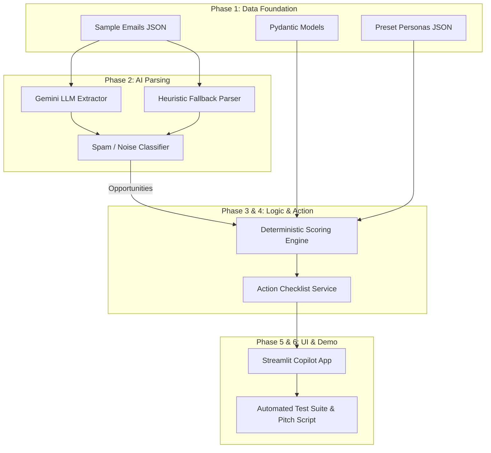

# 📑 Opportunity Inbox Copilot — Master Specification Index
**SOFTEC 2026 AI Hackathon Competition**  
*Step-by-Step Phased Implementation Roadmap*

---

## 🗺️ Implementation Phases Overview

| Phase | Specification Document | Focus Area & Target Deliverables | Files Involved |
| :---: | :--- | :--- | :--- |
| **Phase 1** | [**Phase 1: Data Models & Test Datasets**](file:///home/dev/Personalized%20Opportunity%20Ranking/plan/phase-1-data-and-models.md) | Pydantic schemas, config weights ($40/35/25$), 10 realistic test emails, and 4 student personas. | `models/profile.py`, `models/opportunity.py`, `config.py`, `data/sample_emails.json`, `data/preset_profiles.json` |
| **Phase 2** | [**Phase 2: Email Parser Service**](file:///home/dev/Personalized%20Opportunity%20Ranking/plan/phase-2-email-parser-service.md) | AI-powered entity extraction, noise/spam classification, date parsing, and heuristic fallback. | `services/email_parser.py`, `services/__init__.py` |
| **Phase 3** | [**Phase 3: Deterministic Scoring Engine**](file:///home/dev/Personalized%20Opportunity%20Ranking/plan/phase-3-deterministic-scoring-engine.md) | Pure Python mathematical scoring formula, urgency brackets, ineligibility penalty, evidence rationale. | `services/scoring_engine.py` |
| **Phase 4** | [**Phase 4: Action Checklist Generator**](file:///home/dev/Personalized%20Opportunity%20Ranking/plan/phase-4-checklist-and-action-generator.md) | Automated document preparation to-dos, portal URLs, and deadline calendar reminders. | `services/checklist_service.py` |
| **Phase 5** | [**Phase 5: Streamlit Dashboard UI**](file:///home/dev/Personalized%20Opportunity%20Ranking/plan/phase-5-streamlit-dashboard-ui.md) | Interactive frontend with live persona switcher, rank cards, scoring matrix tab, and custom CSS. | `app.py`, `assets/styles.css` |
| **Phase 6** | [**Phase 6: Testing & Judge Demo Playbook**](file:///home/dev/Personalized%20Opportunity%20Ranking/plan/phase-6-testing-and-judge-demo-playbook.md) | End-to-end verification test suite and scripted 2-minute elevator pitch for competition judges. | `test_pipeline.py`, demo walkthrough |

---

## 🎯 Architecture Diagram

---

## 🚀 Execution Workflow
When you are ready to write code, we can proceed phase-by-phase:
1. Complete **Phase 1** and verify model exports and data fixtures.
2. Implement **Phase 2** and verify entity extraction and spam filtering.
3. Implement **Phase 3 & 4** and verify deterministic math and checklist generation.
4. Implement **Phase 5** and run the Streamlit UI locally.
5. Run **Phase 6** tests and rehearse the judge demo flow!
