# 🎓 Opportunity Inbox Copilot — Master Plan & Implementation Roadmap
**SOFTEC 2026 AI Hackathon Competition**
*Email Parsing & Personalized Opportunity Ranking System*

---

## 📌 1. Executive Summary & Project Vision

University students are inundated with dozens of unorganized emails every week regarding scholarships, internships, hackathons, research fellowships, and job openings. Because of messy natural language, buried deadlines, and information overload, students routinely miss critical career opportunities.

**Opportunity Inbox Copilot** is an intelligent assistant that ingests raw student inbox emails and a structured student profile to:
1. **Filter** real opportunities from campus chatter, ads, and spam.
2. **Extract** structured metadata (deadlines, eligibility requirements, required documents, application URLs).
3. **Deterministically Score & Rank** opportunities tailored to the student's unique academic standing, interests, and urgency.
4. **Generate** an evidence-backed rationale and an actionable document preparation checklist.

---

## 🎯 2. System Architecture & Pipeline

```mermaid
flowchart TD
    subgraph Inputs
        A[Raw Email Batch / Notices<br/>5-15 Emails]
        B[Structured Student Profile<br/>Degree, CGPA, Skills, Need, Preferences]
    end

    subgraph AI Parsing & Extraction Engine
        A --> C[Opportunity Classifier<br/>LLM / Prompt Filter]
        C -->|Irrelevant/Spam| S[Spam / Notice Bin]
        C -->|Genuine Opportunity| D[Structured Field Extractor<br/>Pydantic Schema / JSON Mode]
        D --> E[Parsed Opportunity Objects<br/>Deadlines, Eligibility, Docs, Links]
    end

    subgraph Deterministic Scoring Engine
        B --> F[Scoring & Ranking Logic]
        E --> F
        F --> G[Profile Fit Score (40%)]
        F --> H[Urgency Score (35%)]
        F --> I[Impact & Completeness Score (25%)]
        G & H & I --> J[Final Composite Score & Rank]
    end

    subgraph User Experience & Output
        J --> K[Interactive Priority Inbox Dashboard]
        K --> L[Evidence-Backed Ranking Explanations]
        K --> M[Personalized Action Checklist & Calendar Alerts]
    end
```

---

## 🛠️ 3. Recommended Technology Stack

| Layer | Recommended Technology | Rationale |
| :--- | :--- | :--- |
| **Backend & Services** | **Python (Modules / Services)** | Fast, clean modular Python architecture; direct in-process integration with Streamlit. |
| **LLM Engine** | **Gemini API (gemini-1.5-flash / gemini-2.0-flash)** | Fast inference speed, high context window, strict JSON schema support. |
| **Data Validation** | **Pydantic v2** | Strong typing for extracted email entities and deterministic scoring models. |
| **Scoring Engine** | **Pure Python Module** | Deterministic, transparent, and auditable mathematical scoring rules. |
| **Frontend UI** | **Streamlit + Custom Modern CSS** | 100% Python-native, fast iteration, reactive widgets, instant live re-ranking without frontend overhead. |

---

## 📋 4. Detailed Functional Requirements

### A. Input Specifications
1. **Student Profile Model (Form-Based)**:
   - `major` / `degree`: (e.g., Computer Science, Electrical Engineering, Business)
   - `semester`: Current semester (1 to 8)
   - `cgpa`: Float (0.00 – 4.00)
   - `skills`: List of strings (e.g., `["Python", "Machine Learning", "React"]`)
   - `interests`: List of domains (e.g., `["AI Research", "Web Development", "Fintech"]`)
   - `preferred_types`: Preferred opportunity categories (`["Scholarship", "Internship", "Hackathon"]`)
   - `financial_need`: Boolean or High/Medium/Low
   - `location_preference`: Remote / On-site / Hybrid / Specific City
   - `experience_summary`: Key past experiences / projects

2. **Email Ingestion Module**:
   - Accepts raw text, `.eml`, or JSON batch of 5 to 15 emails.
   - Includes realistic diversity: 2-3 spam/general university notices, 8-12 real opportunity emails with varied deadlines.

---

### B. AI Parsing & Entity Schema
Each detected opportunity will be parsed into the following structured JSON schema:

```json
{
  "email_id": "email_001",
  "is_opportunity": true,
  "rejection_reason": null,
  "title": "Google Summer of Code 2026 Mentorship",
  "organization": "Google Open Source",
  "opportunity_type": "Internship / Mentorship",
  "deadline": "2026-03-15T23:59:00Z",
  "days_until_deadline": 14,
  "eligibility": {
    "min_cgpa": null,
    "eligible_majors": ["Computer Science", "Software Engineering", "Data Science"],
    "eligible_semesters": [4, 5, 6, 7, 8],
    "financial_need_required": false,
    "other_criteria": "Open source contributions"
  },
  "required_documents": [
    "Project Proposal",
    "GitHub Profile",
    "Student ID / Enrollment Verification"
  ],
  "benefits": "Stipend ($1500 - $3000), Global Mentorship, Certificate",
  "application_link": "https://summerofcode.withgoogle.com",
  "contact_email": "support@summerofcode.com",
  "summary_snippet": "A 12-week open-source programming mentorship for university students."
}
```

---

### C. Deterministic Scoring & Ranking Algorithm
The ranking must be mathematical, explainable, and deterministic (not random LLM output).

$$\text{Total Score} = (W_{\text{fit}} \times S_{\text{fit}}) + (W_{\text{urgency}} \times S_{\text{urgency}}) + (W_{\text{completeness}} \times S_{\text{completeness}}) - \text{Penalty}_{\text{ineligible}}$$

#### 1. Profile Fit Score ($S_{\text{fit}}$: 0 – 100, Weight: 40%)
* **CGPA Match**:
  * If $\text{Student CGPA} \ge \text{Min CGPA}$: $+25\text{ pts}$ (or full points if no CGPA requirement).
  * If $\text{Student CGPA} < \text{Min CGPA}$: $-50\text{ pts}$ (Ineligibility penalty).
* **Major / Program Match**: $+25\text{ pts}$ if student's major is eligible.
* **Skill / Interest Overlap**: $+25\text{ pts}$ based on match of keywords.
* **Preferred Opportunity Type**: $+25\text{ pts}$ if type matches student's top preferences.

#### 2. Urgency Score ($S_{\text{urgency}}$: 0 – 100, Weight: 35%)
* $0 \text{ to } 2 \text{ days remaining}$: $100\text{ pts}$ (🚨 Critical Urgency)
* $3 \text{ to } 7 \text{ days remaining}$: $80\text{ pts}$ (⚡ High Urgency)
* $8 \text{ to } 14 \text{ days remaining}$: $55\text{ pts}$ (⏳ Medium Urgency)
* $15+ \text{ days remaining}$: $30\text{ pts}$ (📅 Low Urgency)
* *Past deadline*: $-1000\text{ pts}$ (Automatically flagged as Expired).

#### 3. Completeness & Impact Score ($S_{\text{completeness}}$: 0 – 100, Weight: 25%)
* Clear application URL and verifiable contact info: $+40\text{ pts}$
* Explicit stipend / award / certificate mentioned: $+30\text{ pts}$
* Clear, non-ambiguous documentation checklist: $+30\text{ pts}$

---

## 🗺️ 5. End-to-End Implementation Roadmap

```mermaid
gantt
    title Hackathon 6-Hour Implementation Timeline
    dateFormat HH:mm
    axisFormat %H:%M

    section Phase 1: Setup & Data
    Project scaffolding & dependencies  :p1_1, 00:00, 00:30
    Curate sample email dataset & profile mock :p1_2, after p1_1, 00:45

    section Phase 2: Core AI Engine
    LLM Structured Parser & Prompt tuning :p2_1, after p1_2, 01:00
    Pydantic validation & fallbacks       :p2_2, after p2_1, 00:30

    section Phase 3: Scoring Module
    Deterministic scoring & ranking logic :p3_1, after p2_2, 00:45
    Action checklist generator            :p3_2, after p3_1, 00:30

    section Phase 4: Streamlit UI
    Interactive Copilot App & Profile Form :p4_1, after p3_2, 01:00
    Cards, score breakdown & checklist view :p4_2, after p4_1, 00:45

    section Phase 5: Polish & Demo Prep
    End-to-end integration & demo script  :p5_1, after p4_2, 00:45
```



---

### Step 1: Project Setup & Environment (`0:00 - 0:30`)
- Initialize repository structure (`/codebase/`).
- Set up Python virtual environment with `streamlit`, `google-genai` / `langchain-google-genai`, `pydantic`, `python-dotenv`.
- Set up `.env` for LLM API keys.

### Step 2: Test Dataset Creation (`0:30 - 1:15`)
Create `sample_emails.json` containing 10-12 diverse student emails:
1. **Urgent Scholarship**: e.g., Need-based merit scholarship closing in 48 hours (Min CGPA 3.2).
2. **High-Value Tech Internship**: e.g., Summer ML internship for 6th-8th semester CS students.
3. **Global Hackathon**: e.g., Open to all university students, deadline in 2 weeks.
4. **Research Fellowship**: e.g., Robotics lab fellowship, strict CGPA 3.7+ requirement.
5. **Irrelevant / Campus Spam**: e.g., Lost and found water bottle notice, university parking permit notice, sports gala ticket promo.
6. **Expired Opportunity**: e.g., Winter competition with deadline already passed.

### Step 3: LLM Parsing & Extraction Pipeline (`1:15 - 2:45`)
- Build the email classifier (Opportunity vs. Non-Opportunity).
- Build the structured entity extractor using strict JSON schema.
- Implement date parsing to convert natural language dates (e.g. *"Next Sunday by midnight"*, *"March 10th"*) into ISO format and calculate `days_left`.

### Step 4: Deterministic Scoring Engine & Checklist Generator (`2:45 - 3:45`)
- Implement `scoring_engine.py`:
  - Calculate `Fit Score`, `Urgency Score`, `Completeness Score`, and `Composite Score`.
  - Generate human-readable "Evidence Tag" (e.g., *"Top Match: Exact CGPA & Major fit + closes in 2 days"*).
  - Flag ineligibility warnings with exact mismatch reason.
- Implement `checklist_service.py`:
  - Extract required documents into a clickable checklist (e.g., *"Upload Updated Resume"*, *"Order Official Transcript from One-Stop"*).

### Step 5: Streamlit Copilot Dashboard (`3:45 - 5:15`)
- Build a responsive single-page Streamlit application (`app.py`):
  - **Sidebar**:
    - Preset Persona selector (e.g., "AI Enthusiast (CGPA 3.8)", "Need-Based Freshman (CGPA 3.1)", "BBA Student")
    - Custom Profile form with real-time reactive inputs (major, CGPA slider, multiselect skills, financial need).
  - **Main Area**:
    - **Header & Metric Counters**: Total Scanned, Genuine Opportunities Detected, Urgent Deadlines (<3 days), Spam Filtered.
    - **Email Ingestion**: Pre-loaded mock inbox selector + raw email paste expander.
    - **Tabs**:
      1. 🏆 **Ranked Priority Feed**: Cards styled with custom CSS, rank badges, urgency timers, match breakdowns, and interactive action checklists.
      2. 📊 **Scoring Matrix / Determinism Breakdown**: Detailed inspectable table showing raw scoring math ($S_{\text{fit}}, S_{\text{urgency}}, S_{\text{completeness}}$).
      3. 🗑️ **Filtered Noise / Spam Bin**: Inspect non-opportunity emails and why the AI rejected them.

### Step 6: Testing, Polish & Demo Rehearsal (`5:15 - 6:00`)
- Run end-to-end test runs on all sample emails.
- Verify real-time profile switching (changing CGPA or major instantly re-ranks the feed).
- Polish custom CSS styling for badges, cards, and urgency indicators.

---

## 🏆 6. Winning Edge: What Will Impress the Judges

1. **True Determinism (Not LLM Hallucination)**: Clearly show the judges the mathematical formula behind why #1 is higher than #2 via the dedicated Scoring Matrix tab.
2. **Transparent "Why" (Evidence-Backed)**: Every ranking has a bulletproof rationale (CGPA fit, deadline pressure, major match).
3. **Actionable Output**: Not just a summary — gives the student a literal to-do checklist and calendar deadline.
4. **Noise Rejection**: Gracefully separates and categorizes spam/announcements without cluttering the student's feed.
5. **Interactive Profile Switching**: Live toggle between 2-3 student personas during the presentation to prove dynamic personalization!

---

## 📁 7. Streamlit Project Structure

```text
Personalized Opportunity Ranking/
├── AI Hack - Question Paper.pdf
├── master-plan.md                   <-- (Updated with Streamlit)
└── codebase/
    ├── app.py                       # Main Streamlit Dashboard
    ├── config.py                    # Environment & API configurations
    ├── models/
    │   ├── profile.py               # StudentProfile Pydantic schema
    │   └── opportunity.py           # ParsedOpportunity & RankedOpportunity schema
    ├── services/
    │   ├── email_parser.py          # LLM Classifier & Field Extractor
    │   ├── scoring_engine.py        # Deterministic scoring algorithm
    │   └── checklist_service.py     # Next-steps checklist generator
    ├── data/
    │   ├── sample_emails.json       # 10-15 Realistic test emails
    │   └── preset_profiles.json     # 3-4 Quick-demo student personas
    ├── assets/
    │   └── styles.css               # Modern CSS for Streamlit cards & badges
    ├── requirements.txt             # Python dependencies
    └── .env                         # API Key configurations
```
