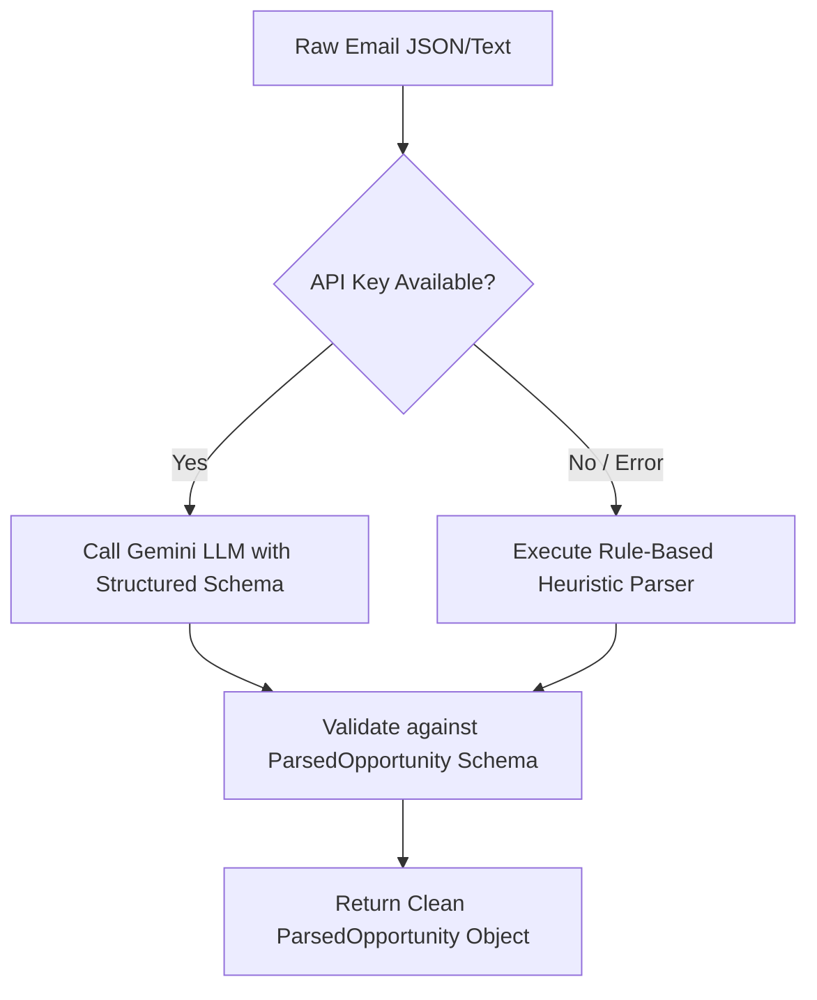

# 📁 Phase 2 Specification: AI Email Parsing & Entity Extraction Service
**Phase:** 2 of 6  
**Focus:** LLM Classification, Structured Entity Extraction, Date Normalization & Offline Heuristic Fallback

---

## 🎯 1. Phase Objective
Build an AI parsing service that accepts messy, natural language email texts and transforms them into strictly validated `ParsedOpportunity` objects. The service must classify whether an email is a genuine opportunity or noise/spam, extract all key metadata (deadlines, eligibility rules, required documents, URLs), and provide a fast, deterministic offline fallback when an API key is unavailable.

---

## 📂 2. Files to Implement in this Phase

| File Path | Purpose |
| :--- | :--- |
| [`codebase/services/email_parser.py`](file:///home/dev/Personalized%20Opportunity%20Ranking/codebase/services/email_parser.py) | Main parsing service class (`EmailParserService`) with LLM & heuristic parsers. |
| [`codebase/services/__init__.py`](file:///home/dev/Personalized%20Opportunity%20Ranking/codebase/services/__init__.py) | Export parsing service for easy module access. |

---

## 🧱 3. Detailed Specifications & Logic

### A. Core Requirements of `EmailParserService`

1. **Noise / Spam Classification**:
   - Detect non-opportunity emails (Lost & Found, parking notices, facility maintenance, sports ticket notices).
   - Set `is_opportunity = False` and populate `rejection_reason` with a human-readable explanation.
   - Flag expired notices (events with deadlines in the past) appropriately.

2. **Entity Extraction (JSON Mode / Pydantic)**:
   - **`opportunity_type`**: Scholarship, Internship, Hackathon / Competition, Research / Fellowship, Workshop / Conference, Job.
   - **`deadline`**: Normalized ISO string `YYYY-MM-DD` and relative `days_until_deadline`.
   - **`eligibility`**:
     - `min_cgpa`: Extracted numeric float (e.g. `3.0`, `3.75`) or `null` if unrestricted.
     - `eligible_majors`: List of target degrees (e.g. `["Computer Science", "Software Engineering"]`).
     - `eligible_semesters`: List of integers (e.g. `[6, 7, 8]`).
     - `financial_need_required`: Boolean flag for need-based programs.
   - **`required_documents`**: List of strings (e.g. `["Academic Transcript", "Updated Resume", "SOP"]`).
   - **`benefits`**: Extracted stipend, prize pool, housing, certificate, or credit.
   - **`application_link`** & **`contact_email`**: Verified URLs (`https://...`) and contact addresses.

3. **Gemini LLM Prompting (`parse_with_gemini`)**:
   - Use `google.generativeai` / `google-genai` with `response_mime_type="application/json"`.
   - Provide a clear system prompt with the exact expected JSON schema.

4. **Deterministic Heuristic Fallback (`parse_with_heuristics`)**:
   - Uses regex and keyword heuristics to ensure the application is 100% functional even offline or if API rate limits are hit.
   - Regex patterns for CGPA (`cgpa\s*(?:of|>=|:|\s)\s*([0-3]\.[0-9]{1,2}|4\.00?)`), URLs, and dates.

5. **Batch Ingestion (`parse_email_batch`)**:
   - Processes a list of 5 to 15 emails sequentially or concurrently and returns `List[ParsedOpportunity]`.

---

## 🧪 4. Verification & Test Cases

1. **Spam Rejection Test**:
   - Input: Email #06 (Lost Water Bottle in Lab 3).
   - Expected Output: `is_opportunity == False`, `rejection_reason` mentions campus notice.
2. **Strict Requirement Extraction Test**:
   - Input: Email #03 (CSAIL Fellowship).
   - Expected Output: `is_opportunity == True`, `min_cgpa == 3.75`, `required_documents` contains Transcript, SOP, LORs.
3. **Deadline Parsing Test**:
   - Input: Email #01 (Deadline March 3, 2026).
   - Expected Output: `deadline == "2026-03-03"`, `days_until_deadline == 2`.
