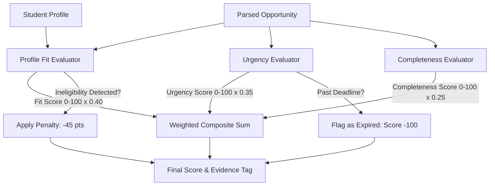

# 📁 Phase 3 Specification: Deterministic Scoring & Priority Ranking Engine
**Phase:** 3 of 6  
**Focus:** Mathematical Scoring Algorithm, Urgency Brackets, Ineligibility Penalties & Evidence Rationale Generation

---

## 🎯 1. Phase Objective
Implement the core deterministic scoring and ranking algorithm in pure Python. The engine takes extracted opportunity facts from Phase 2 and evaluates them against the student's structured profile to compute an auditable composite score, rank opportunities, apply ineligibility penalties, and generate transparent evidence tags explaining *why* each item is placed at its rank.

---

## 📂 2. Files to Implement in this Phase

| File Path | Purpose |
| :--- | :--- |
| [`codebase/services/scoring_engine.py`](file:///home/dev/Personalized%20Opportunity%20Ranking/codebase/services/scoring_engine.py) | Main `ScoringEngine` class containing the mathematical ranking algorithm. |
| [`codebase/services/__init__.py`](file:///home/dev/Personalized%20Opportunity%20Ranking/codebase/services/__init__.py) | Export `ScoringEngine` for application-wide use. |

---

## 📐 3. Mathematical Formula & Scoring Architecture

$$\text{Final Score} = (0.40 \times S_{\text{fit}}) + (0.35 \times S_{\text{urgency}}) + (0.25 \times S_{\text{completeness}}) - \text{Penalty}_{\text{ineligible}}$$

---

## 🧱 4. Detailed Component Specifications

### A. Profile Fit Score ($S_{\text{fit}}$: 0 to 100 pts, Weight: 40%)
Evaluates compatibility across 4 dimensions ($25\text{ pts}$ each):
1. **CGPA Match ($25\text{ pts}$)**:
   - If `profile.cgpa >= eligibility.min_cgpa` or no CGPA requirement: $+25\text{ pts}$ (Eligible).
   - If `profile.cgpa < eligibility.min_cgpa`: $0\text{ pts}$ + flag ineligibility.
2. **Major Match ($25\text{ pts}$)**:
   - If `profile.degree` matches any `eligibility.eligible_majors` or open to all: $+25\text{ pts}$.
   - Else: $0\text{ pts}$ + flag ineligibility.
3. **Skill & Interest Overlap ($25\text{ pts}$)**:
   - $\ge 3$ matching skills/interests in opportunity corpus: $+25\text{ pts}$.
   - $1 - 2$ matches: $+15\text{ pts}$.
   - Minimal overlap: $+5\text{ pts}$.
4. **Preferred Opportunity Type ($25\text{ pts}$)**:
   - If opportunity type matches student's top preferred list: $+25\text{ pts}$.
   - If secondary type: $+10\text{ pts}$.
5. **Financial Need Bonus**:
   - If opportunity is need-based and student has `financial_need == True`: $+10\text{ pts}$ bonus (capped at 100).

### B. Urgency Score ($S_{\text{urgency}}$: 0 to 100 pts, Weight: 35%)
Evaluates deadline proximity from reference date:
- **$0 \le \text{days} \le 2$**: $100\text{ pts}$ (🚨 Critical Urgency — Immediate action required)
- **$3 \le \text{days} \le 7$**: $80\text{ pts}$ (⚡ High Urgency — Prepare documents this week)
- **$8 \le \text{days} \le 14$**: $55\text{ pts}$ (⏳ Medium Urgency — Two weeks remaining)
- **$\text{days} \ge 15$**: $30\text{ pts}$ (📅 Low Urgency — Planned for later)
- **$\text{days} < 0$**: $-1000\text{ pts}$ (❌ Expired)

### C. Completeness & Impact Score ($S_{\text{completeness}}$: 0 to 100 pts, Weight: 25%)
Evaluates application quality and ease of action:
- **Verified URL / Contact ($40\text{ pts}$)**: $+40\text{ pts}$ if `http` link present; $+25\text{ pts}$ if email present.
- **Explicit Benefits & Perks ($30\text{ pts}$)**: $+30\text{ pts}$ if stipend, cash prize, or fellowship grant identified.
- **Enumerated Document List ($30\text{ pts}$)**: $+30\text{ pts}$ if specific required documents are extracted.

### D. Ineligibility Penalty & Sorting
- If student fails any mandatory criterion (e.g. CGPA below minimum or ineligible major), deduct $\text{Penalty} = 45\text{ pts}$ and mark `is_eligible = False`.
- Sort all valid opportunities in descending order of `final_score`.
- Assign 1-based ranks (`#1`, `#2`, `#3`...).

### E. Dynamic Evidence Tag Generation
Generate concise, human-readable rationale strings:
- *"🔥 Top Priority Match: Outstanding profile alignment & closes in 2d"*
- *"⭐ High Fit Match: Strong degree and skill alignment (95% fit)"*
- *"⚠️ Ineligibility Alert: Student CGPA (3.10) is below minimum required 3.75"*
- *"❌ Deadline Expired: Submissions closed"*

---

## 🧪 5. Verification & Acceptance Criteria
- [ ] Changing a student's CGPA from `3.85` to `3.20` dynamically pushes the MIT CSAIL fellowship from Top 3 down to the bottom with an ineligibility warning.
- [ ] Changing student major from `Computer Science` to `BBA` immediately elevates the McKinsey Business Analyst internship to Rank #1.
- [ ] Expired opportunities always receive a negative score and sink to the bottom.
