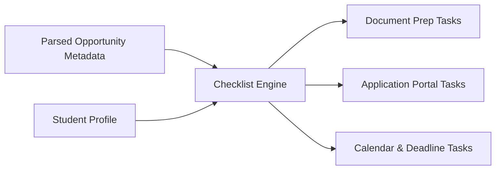

# 📁 Phase 4 Specification: Action Checklist & Next-Steps Generator
**Phase:** 4 of 6  
**Focus:** Automated Document To-Dos, Application Links & Deadline Calendar Reminders

---

## 🎯 1. Phase Objective
Build the `ChecklistService` that converts parsed opportunity requirements into a concrete, interactive, and personalized to-do checklist for the student. Instead of leaving the user with a generic summary, this service generates specific preparation tasks (transcripts, tailored resumes, recommendation letters, income slips) and direct submission actions.

---

## 📂 2. Files to Implement in this Phase

| File Path | Purpose |
| :--- | :--- |
| [`codebase/services/checklist_service.py`](file:///home/dev/Personalized%20Opportunity%20Ranking/codebase/services/checklist_service.py) | Service class (`ChecklistService`) that constructs `List[ActionItem]`. |
| [`codebase/services/__init__.py`](file:///home/dev/Personalized%20Opportunity%20Ranking/codebase/services/__init__.py) | Export module for clean imports. |

---

## 🧱 3. Detailed Logic & Task Mapping

### A. Document Preparation Tasks (`category="Document"`)
The service inspects `opportunity.required_documents` and generates tailored task descriptions:

| Extracted Keyword | Generated Task Text |
| :--- | :--- |
| **Transcript** | `"Request / Download Official Academic Transcript (Current CGPA: {profile.cgpa})"` |
| **Resume / CV** | `"Tailor Resume highlighting relevant skills: {profile.skills[:3]}"` |
| **SOP / Proposal** | `"Draft and proofread Statement of Purpose / Project Proposal"` |
| **Recommendation / LOR** | `"Contact department professors/advisors for Letters of Recommendation"` |
| **Salary / Income** | `"Obtain Guardian Income Certificate / Salary Slips for financial review"` |
| **ID / CNIC** | `"Prepare scanned copy of Student ID Card / CNIC"` |
| **Generic / Other** | `"Prepare required document: {doc_name}"` |

### B. Application & Submission Tasks (`category="Application"`)
- If `opportunity.application_link` exists:
  - Task: `"Complete and submit application form on official portal ({opportunity.organization})"`
- If `opportunity.contact_email` exists and no web portal:
  - Task: `"Compose application email and attach documents to {opportunity.contact_email}"`
- If no link or email:
  - Task: `"Follow up with department coordinator or listed society POC"`

### C. Calendar & Urgency Tasks (`category="Calendar"`)
- If `opportunity.deadline` exists:
  - Task: `"Set calendar reminder for submission deadline: {opportunity.deadline}"`

---

## 🧪 4. Verification & Acceptance Criteria
- [ ] For Email #01 (Scholarship), the checklist includes Salary Slip, Official Transcript, and Portal link.
- [ ] For Email #03 (Fellowship), the checklist includes contacting professors for LORs, drafting Research SOP, and Submitting to MIT CSAIL portal.
- [ ] In Streamlit, every action item renders as a clickable, checkable interactive checkbox.
